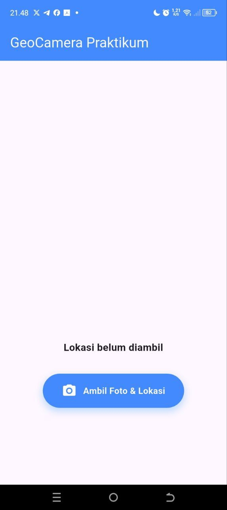
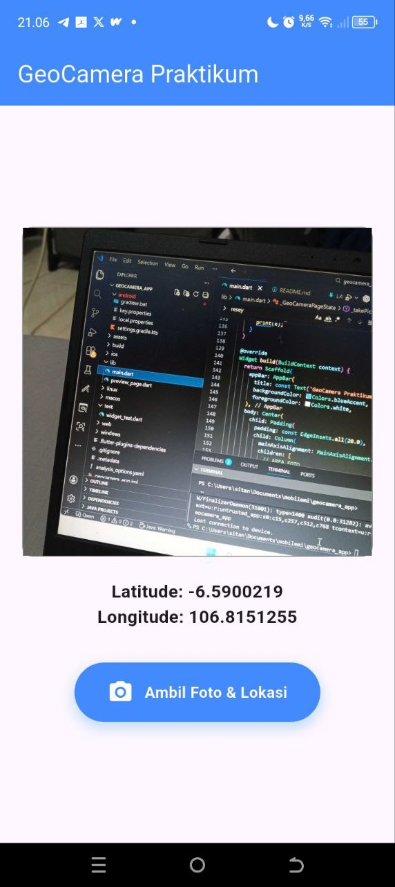

# Nama : Sita Novitasari
# NPM  : 085023006


# GeoCamera App

Aplikasi Flutter yang menggabungkan fitur kamera dan GPS untuk mengambil foto beserta lokasi geografis. Aplikasi ini dibuat sebagai bagian dari Praktikum 8 - Animasi dan Interaksi di Flutter.

## Fitur Utama

- ✅ **Ambil Foto**: Mengambil foto langsung dari kamera perangkat
- 📍 **Dapatkan Lokasi**: Mengambil koordinat latitude dan longitude GPS
- 🎬 **Animasi Fade-In**: Foto muncul dengan efek fade-in yang halus
- 🔘 **Efek Tombol**: Tombol dengan animasi scale saat ditekan
- 🖼️ **Hero Animation**: Transisi halus saat foto diklik untuk preview fullscreen

## Screenshots

### Tampilan Awal Aplikasi


### Halaman Depan


### Mengambil Foto


### Hasil Foto dan Lokasi GPS



## Prasyarat

Sebelum menjalankan aplikasi ini, pastikan Anda sudah menginstall:

- [Flutter SDK](https://flutter.dev/docs/get-started/install) (versi 3.0 atau lebih baru)
- [Android Studio](https://developer.android.com/studio) atau [Visual Studio Code](https://code.visualstudio.com/)
- Android Emulator atau perangkat Android fisik dengan kamera

## Instalasi

1. **Clone repository**
   ```bash
   git clone <repository-url>
   cd geocamera_app
   ```

2. **Install dependencies**
   ```bash
   flutter pub get
   ```

3. **Konfigurasi izin kamera dan lokasi**

   Untuk **Android**, edit file `android/app/src/main/AndroidManifest.xml`:
   ```xml
   <uses-permission android:name="android.permission.CAMERA" />
   <uses-permission android:name="android.permission.ACCESS_FINE_LOCATION" />
   <uses-permission android:name="android.permission.ACCESS_COARSE_LOCATION" />
   ```

   Untuk **iOS**, edit file `ios/Runner/Info.plist`:
   ```xml
   <key>NSCameraUsageDescription</key>
   <string>Aplikasi membutuhkan izin kamera untuk mengambil foto</string>
   <key>NSLocationWhenInUseUsageDescription</key>
   <string>Aplikasi membutuhkan izin lokasi untuk mendapatkan koordinat GPS</string>
   ```

4. **Jalankan aplikasi**
   ```bash
   flutter run
   ```

## Cara Penggunaan

1. Buka aplikasi GeoCamera di perangkat atau emulator
2. Tekan tombol **"Ambil Foto & Lokasi"**
3. Aplikasi akan membuka kamera - ambil foto dan tekan tombol konfirmasi
4. Aplikasi akan mengambil lokasi GPS perangkat Anda
5. Foto akan muncul dengan animasi fade-in yang halus
6. Lokasi (latitude & longitude) akan ditampilkan di bawah foto
7. **Klik pada foto** untuk melihat preview fullscreen dengan Hero Animation
8. Tekan tombol back untuk kembali ke halaman utama

## Teknologi yang Digunakan

- **Flutter** - Framework UI untuk membangun aplikasi mobile
- **Dart** - Bahasa pemrograman utama
- **image_picker** - Package untuk mengakses kamera dan galeri
- **geolocator** - Package untuk mendapatkan lokasi GPS
- **AnimatedOpacity** - Widget untuk animasi fade-in
- **AnimatedScale** - Widget untuk animasi skala tombol
- **Hero Animation** - Widget untuk transisi antar halaman

## Struktur Project

```
lib/
├── main.dart              # Halaman utama aplikasi dengan fitur kamera & GPS
└── preview_page.dart      # Halaman preview fullscreen foto
```

## Author

Dibuat sebagai bagian dari Praktikum Mobile 2 

## Lisensi

MIT License
